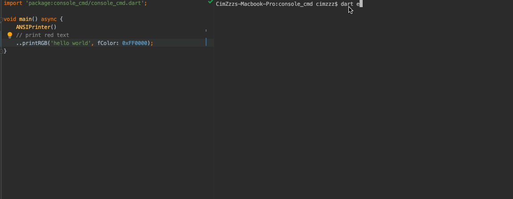
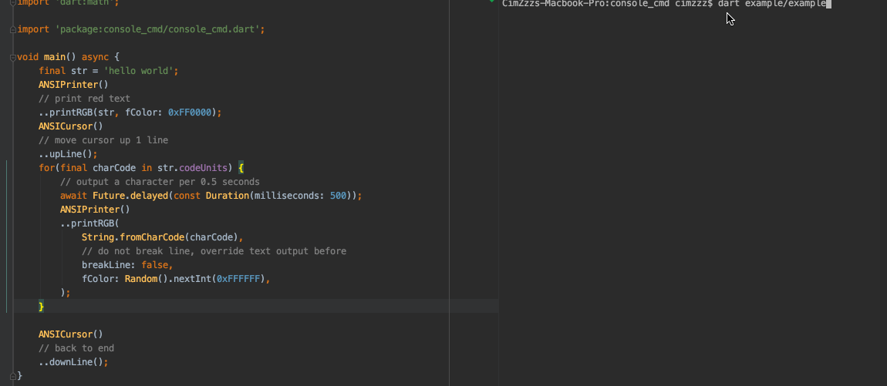
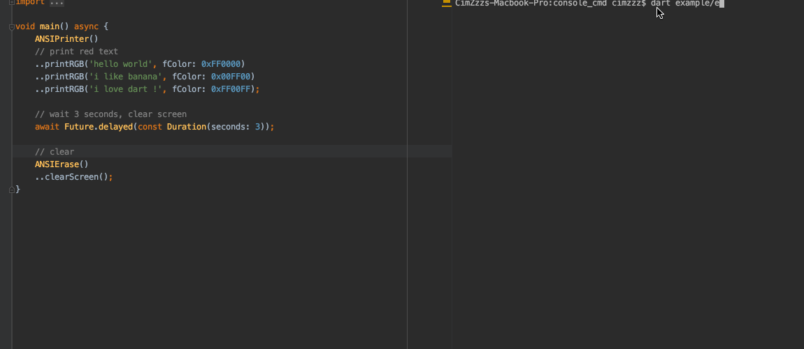

# console_cmd

a series method for developing console application

about line-move, color text and clear method

## Usage

Latest version : 1.0.5

add in pubspec.yaml

```yaml
dependencies:
  console_cmd: ^1.0.5
```

### ANSIPrinter



```dart
class ANSIPrinter {
    /// Output RGB Color text
    /// - [text] : text you want output
    /// - [breakLine] : whether break line after output
    /// - [fColor] : foreground color
    /// - [fGray] : foreground color's grey scale value
    /// - [bColor] : background color
    /// - [bGray] : background color's grey scale value
    void printRGB(String text, {bool breakLine = true, int fColor, double fGray, int bColor, double bGray});

    /// Output terminal text
    /// - [text] : text you want output
    /// - [breakLine] : whether break line after output
    void print(String text, {bool breakLine = true});
}
```

---

### ANSICursor




```dart
class ANSICursor {
    /// Move cursor up # lines
    /// - [lineCount] : line count
    /// - [beginOfLine] : move to line-start
    void upLine({int lineCount = 1, bool beginOfLine = true})
    
    /// Move cursor down # lines
    /// - [lineCount] : line count
    /// - [beginOfLine] : move to line-start
    void downLine({int lineCount = 1, bool beginOfLine = true})
    
    /// Move cursor right # space
    /// - [spaceCount] : space count
    void goRight({int spaceCount = 1})
    
    /// Move cursor left # space
    /// - [spaceCount] : space count
    void goLeft({int spaceCount = 1})
    
    /// Move cursor to line-start
    void beginLine()

	/// Locate the cursor at specify point
	/// - [point] : specify cursor point
	void locateCursor({ANSICursorPoint point})

    /// Store current cursor position
    /// Return the cursor point index in stored-point list
    ///
    /// * Note that !
    ///
    /// Screen will screen when output a lots message, so some old `stored-point`
    /// may be invalid, because it record the old point not now.
    ///
    Future<int> storeCursorPoint();

    /// Restore to position saved before.
	/// [storePointIdx] : stored-point index, return by [storeCursorPoint]. if this value is `-1`,
	/// means restore to the previous stored-point.
	///
	/// [popBefore] : pop all point stored after restored point
	///
	void restoreToSavePosition({int storePointIdx = -1, bool popBefore = true})
}

```

---

### ANSIErase



```dart

class ANSIErase {
    /// Clear the screen and home cursor
    void clearScreen()
    
    /// Clear line until end
    /// - [beginOfLine] : whether clear whole line
    void clearLine({bool beginOfLine = true})
}
```

---

### StdinManager

```dart
class StdinManager {
    /// Insert stdin observer, the new one will grab data stream
	/// for own use, until next observer come or close by itself
	StdinSubscription insertObserver(StdinObserver observer)

    /// Close stdin stream
	void close()
}
```

### Note that

Program must run in the `terminal or cmd`，if not take effect

> e.g. "dart xxx.dart" in your terminal instead of IDE run